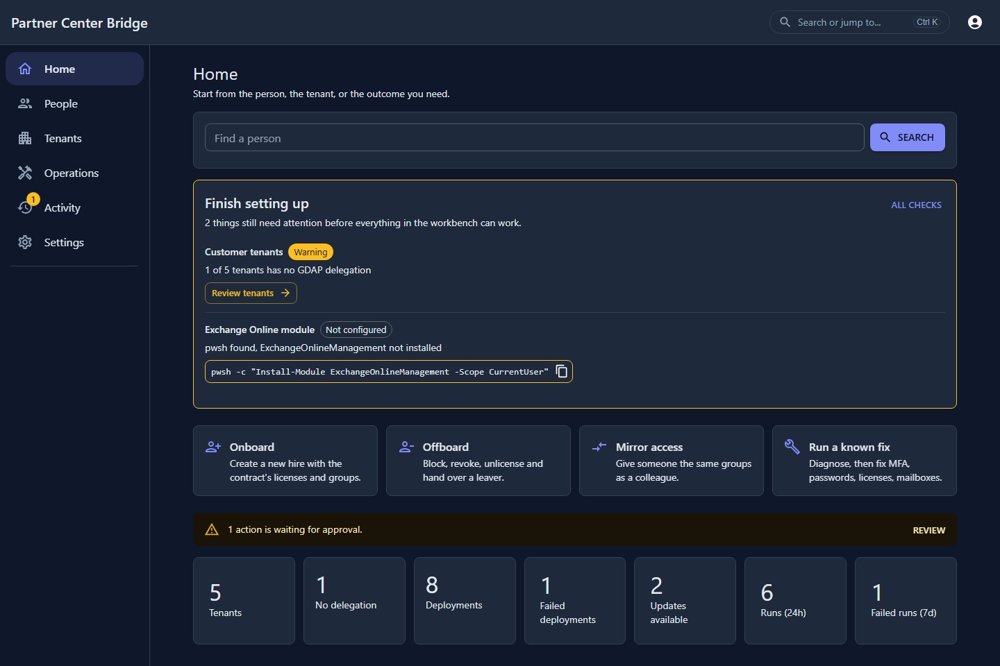
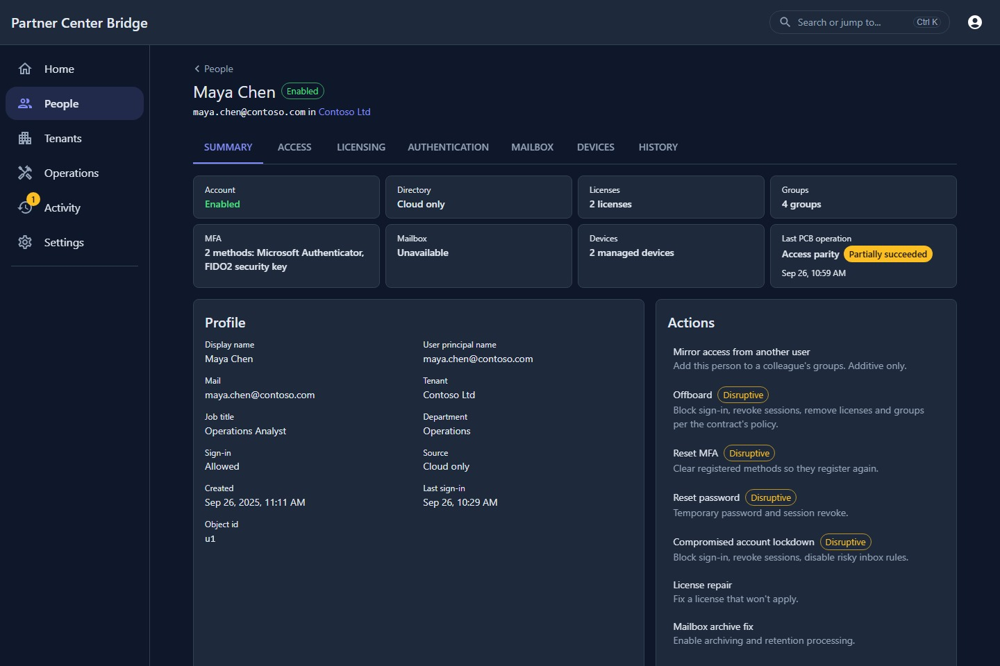
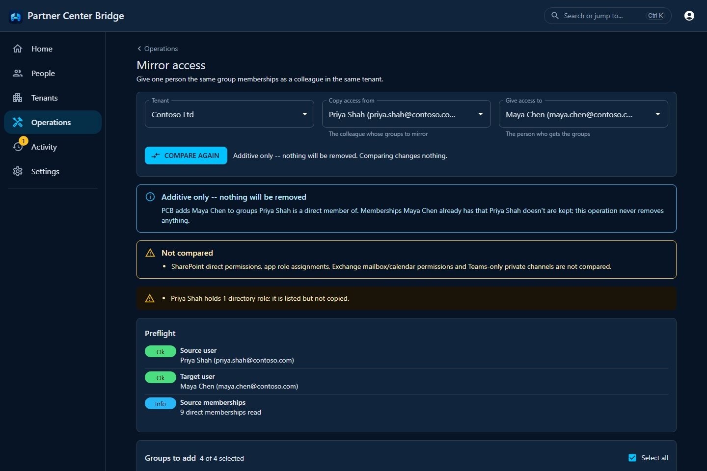
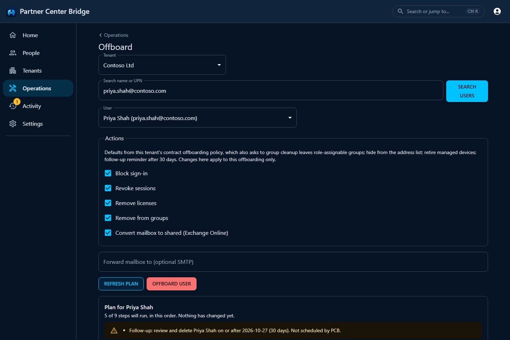
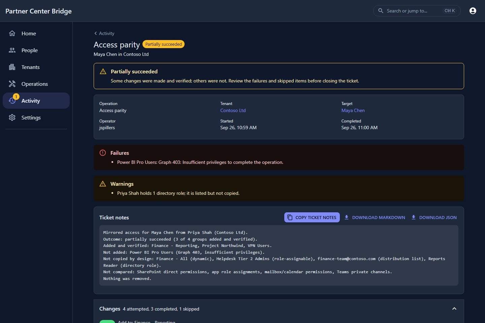
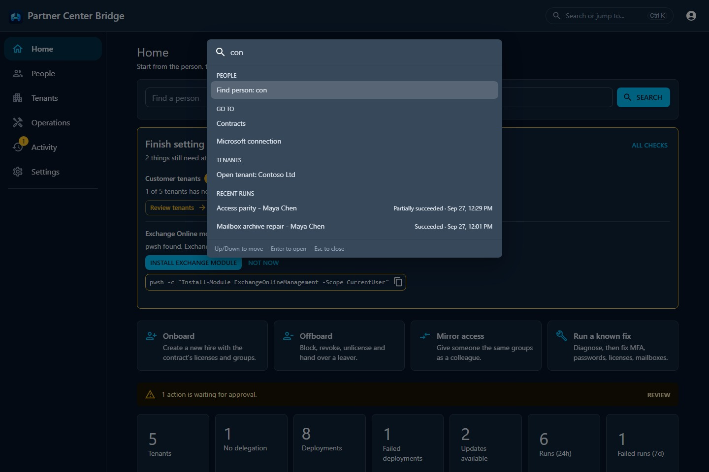

# Partner Center Bridge


**Docs:** <https://spillerstech.us/PartnerCenterBridge/>

A Microsoft 365 operations workbench for MSPs and internal IT: you start from a **tenant, a
person, a problem, or an outcome**, and the bridge takes it through one loop — **Diagnose → Plan
→ Apply → Verify → Record**. It fronts Microsoft Graph, the Partner Center REST API, and
(optionally) Exchange Online PowerShell, and it never fakes capability: a section it cannot read
or an action it cannot perform says so, with the reason, instead of pretending to succeed. Each
**contract** declares a desired state (starting with Win32 app templates) and the bridge
reconciles every tenant on the contract to it.

> **Maturity (v0.8.0), feature by feature:**
>
> | Capability | Status |
> |---|---|
> | Templated Win32 `.intunewin` deploy across tenants, with updates | **Stable** |
> | Contract-driven new-hire provisioning + offboarding via Graph | **Stable** |
> | Cross-tenant person search (People) with per-person fix shortcuts | **Stable** |
> | Known-fix workflow library (MFA reset, password reset, compromised lockdown, license repair) | **Beta** |
> | Exchange Online mailbox ops via EXO PowerShell V3 (mailbox archive repair) | **Beta** |
> | Config snapshots: section/whole-tenant diff, exportable patches, optional git sync | **Beta** |
> | MCP server (Streamable HTTP at `/mcp`) with a per-tenant human approval queue | **Beta** |
> | Local Workbench: single `.exe`, SQLite, local accounts, no server to stand up | **Beta** |
> | Person workspace (profile/licenses/groups/auth/mailbox/devices/history in one read) | **Beta** |
> | Access Parity: copy a source user's missing cloud group memberships to a target, additive-only | **Beta** |
> | Offboarding policy v2: per-contract policy, ordered plan/apply/verify, ticket evidence | **Beta** |
> | Operation evidence (plan/apply/verify JSON, Markdown export) on every planned-operation run | **Beta** |
> | Two-way LDAP sync (Phase 4) | **Planned** — not implemented; no code exists yet |
>
> **Known-fix workflows** run one **Diagnose → Fix → Verify** loop: the diagnosis is shown
> verbatim before anything changes, the fix is applied step by step, and a fresh diagnosis proves
> the result. Every run is persisted with the operator's identity. The **mailbox archive** fix
> ("full / not archiving") enables the archive + auto-expand, ensures a retention policy, clears the
> hidden blockers (retention hold, `ElcProcessingDisabled`), and triggers the Managed Folder
> Assistant — re-running doubles as the nudge the asynchronous move routinely needs. Replaces the
> ~10-cmdlet dance. **Planned operations** (Access Parity, offboarding) generalize the same loop
> with an explicit plan the operator reviews before choosing what to apply, and structured evidence
> (preflight, plan, changes, verification) recorded on every run — see
> [Operation evidence](#operation-evidence) below. The web UI has the reorganized navigation
> (Home/People/Tenants/Operations/Activity/Settings), a person workspace, a Plan/Apply/Verify
> screen for each of the two planned operations, and a Ctrl+K command palette -- see
> [Using PCB](#using-pcb) below for a tour.

## Architecture

Two independent auth planes:

- **Operator plane** — the SPA + API authenticate *you*. Three modes, picked with `Auth:Mode`.
  Full detail: [Authentication](https://spillerstech.us/PartnerCenterBridge/authentication.html).
  - `Oidc` (default) — Authentik or any OIDC provider (JWT bearer). Every authenticated user has
    full operator access; there's no external IdP to run this way without standing one up first.
  - `Local` — self-registered accounts, no external IdP required. Registration is open (no invite
    code), but a fresh account starts with zero tenant and instance access. Tenant power is shared
    explicitly as `Viewer`/`Operator`/`Owner`; even an instance Administrator cannot bypass those
    grants. The first account becomes Administrator and can delegate narrow instance roles for
    catalog authoring, SAM credentials, and automation policy. Tenant onboarding remains
    Administrator-only and grants the onboarding Administrator Owner on each newly added tenant. Passkeys
    (WebAuthn, discoverable/usernameless) are the primary sign-in method; password is the
    permanent fallback. TOTP 2FA is available per-account, with recovery codes. Every auth event
    and every mutation to a user, tenant, contract, template, deployment, or grant is appended to
    an audit trail (`AuditEvents`/`WorkflowRuns`) — see `AuditSaveChangesInterceptor`. Set
    `Auth:Local:SigningKey` (`openssl rand -base64 32`) as a secret; it signs locally issued JWTs.
  - `Dev` — the docker-compose default (`Auth:Enabled=false`): everyone is `dev-operator`, no
    credentials at all. Never use this on a deployed instance.
- **Microsoft plane** — a multi-tenant Entra app under the **Secure Application Model** with a
  GDAP relationship per customer. `SamTokenService` exchanges the stored (encrypted, auto-rotated)
  SAM refresh token for a per-tenant Graph token on demand.

```
web/ (React+Vite+TS)  ──►  src/PartnerCenterBridge.Api  ──►  Core (contracts / desired state / reconcile / workflows / operations)
                                     ├─ Hosting/Diagnostics (Server vs Local profile, CLI, doctor, SPA hosting)
                                     ├─ Graph (GraphTenantClientFactory, IntuneWin32Service, .intunewin reader, Identity + Operations workflows)
                                     ├─ Exchange (ExchangeOnlineService via EXO PowerShell V3, Mailbox workflows)
                                     ├─ PartnerCenter (SamTokenService, PartnerCenterClient)
                                     ├─ Data (EF Core model + Postgres migrations, Data-Protection-encrypted secrets, run history)
                                     └─ Data.Sqlite (same EF Core model, SQLite migrations, for the Local Workbench)
```

| Project | Responsibility |
|---|---|
| `PartnerCenterBridge.Core` | Domain entities, reconcile engine, the `IWorkflow` contract + catalog, the `IPlannedOperation`/evidence model, cross-project abstractions. No external SDK deps. |
| `PartnerCenterBridge.Data` | EF Core `BridgeDbContext` (the shared model) + its Postgres migration set, `ProtectedSamTokenStore`, workflow run history. |
| `PartnerCenterBridge.Data.Sqlite` | The same `BridgeDbContext` model with its own SQLite migration set and design-time factory, WAL + busy-timeout pragmas, used only by the Local Workbench. |
| `PartnerCenterBridge.PartnerCenter` | `SamTokenService` (MSAL SAM flow), `PartnerCenterClient` (REST v3). |
| `PartnerCenterBridge.Graph` | `IntuneWin32Service` (full beta upload state machine), `GraphUserService` (hire/offboard), `.intunewin` reader, tenant client factory, Identity workflows (MFA/password reset, lockdown, license repair), and the Operations workflows (`AccessParityOperation`, `OffboardingOperation`, `PersonDirectoryReader`, `GroupClassifier`). |
| `PartnerCenterBridge.Exchange` | `ExchangeOnlineService` — mailbox config via EXO PowerShell V3 (app-only cert), run out-of-process through `PwshRunner`; the mailbox-archive workflow. |
| `PartnerCenterBridge.Api` | Controllers, OIDC/Local/Dev auth, the `Hosting`/`Diagnostics` layer (profile resolution, CLI, `doctor`, SPA hosting), DI wiring, deploy + provisioning orchestration, workflow/operation dispatch + run recording. |
| `web/` | React SPA: Home, People (search + person workspace), Tenants (list + tenant workspace), Operations (Access Parity, onboard/offboard, deploy, workflows, contracts, templates), Activity (history, approvals, run evidence), Settings, plus sign-in, registration, a Ctrl+K command palette and account security for Local mode. See [Using PCB](#using-pcb). |

## Using PCB

The workbench never has more than six top-level areas -- new screens get a route under an existing
one instead of growing the navigation:

| Area | What it's for |
|---|---|
| **Home** | A person search box, a **Finish setting up** card (only the checks that still need attention, each with its fix), the four most common actions, and the same triage tiles as before (tenants, deployments, failed runs). |
| **People** | Cross-tenant person search, and the person workspace for whoever you pick. |
| **Tenants** | The customer list, and a tenant workspace (overview, access, contract, config snapshots, history) for whoever you pick. |
| **Operations** | Every operation, grouped by outcome: people lifecycle (onboard, offboard, mirror access), known fixes, app deployment, and standards (contracts, app templates). |
| **Activity** | Everything PCB ran or deployed, unified: workflow runs, deployments, and the MCP approval queue, filterable by tenant. |
| **Settings** | Your account and security, the Microsoft (SAM) connection, and workbench health diagnostics. |



### The person workspace

`/people/:tenantId/:userId` is one person in one tenant: seven tabs (Summary, Access, Licensing,
Authentication, Mailbox, Devices, History), each read independently, so one section PCB can't read
(no Exchange configured, missing Graph permission) never blocks the rest -- it shows
**Unavailable** with the specific reason and, where there's something to do about it, a link
straight to the screen that fixes it. The Summary tab's "at a glance" tiles double as shortcuts into
the tab that has the detail. The Actions panel lists every fix and operation PCB can run against
this person, with disruptive ones (MFA reset, password reset, offboarding) flagged so they're never
a casual click, and grayed to preview-only for anyone without Operator on that tenant.



### Mirror access (Access Parity)

`/operations/access-parity` gives a target user the group memberships a source user has and they
lack -- additive only. A link naming the tenant and both people compares automatically on load;
otherwise pick a tenant and two people and press **Compare**. The plan splits eligible groups
(checked by default, individually deselectable) from groups already held (no change needed) from
groups PCB won't copy, each with its reason (dynamic membership, on-premises sync, role-assignable,
mail-enabled/distribution, directory roles) -- the plan also states outright what it never compares
at all (SharePoint direct permissions, direct app role assignments, Exchange mailbox/calendar
permissions, Teams-only channels). Applying shows a confirmation naming the exact groups about to
be added, then re-plans and verifies server-side. Full walkthrough: [Operations](https://spillerstech.us/PartnerCenterBridge/operations.html).



### Offboarding: plan preview and contract policy

`/operations/offboard` starts from the tenant's contract [offboarding policy](#offboarding-policy-v2)
(block sign-in, revoke sessions, remove licenses, remove groups, convert the mailbox) as pre-checked
defaults an operator can still adjust for one leaver. **Preview plan** shows the full ordered list of
steps -- including ones that won't run and why (`hideFromGal`/`managerAccess` have no Exchange
operation yet) -- before anything changes. The same policy has its own editor on the Contracts
screen (instance catalog manager role required to save), so a service tier's defaults are set once
instead of re-typed on every offboarding.



### Evidence

Applying Access Parity, running an offboarding, or opening a past run from Activity or a person's
History tab all land on the same evidence view. Wording always follows the recorded outcome: a
change reported successful that a re-read doesn't confirm shows **Verification failed**, not
Succeeded. Every view has the outcome, who/what/where, failures and warnings called out above the
fold, a **Copy ticket notes** button plus **Download Markdown** / **Download JSON**, and the full
breakdown of changes attempted/completed/skipped, verification checks, preflight and plan --
reachable directly at `/activity/runs/:runId`.



### Command palette (Ctrl+K)

Ctrl+K (Cmd+K on macOS) opens a jump list from anywhere in the app: the six areas and their pages,
"Find person: `<query>`", tenants by name, known fixes, and recent runs (with their outcome) -- all
filtered by every word typed, arrow keys to move, Enter to open.



### First run

A fresh Local-mode install has no accounts, so `/api/system/status` reports `needsFirstUser` and the
SPA sends you straight to registration instead of a sign-in form with nothing to sign in to. The
account you register becomes the instance **Administrator**. From Home, the **Finish setting up**
checklist walks through whatever still needs attention (a tenant with no GDAP delegation, an
unconfigured Exchange module, SAM not bootstrapped), and `/settings/workbench` has the full set of
diagnostics with the same fix links and copyable commands -- see
[Local Workbench: first run, click by click](https://spillerstech.us/PartnerCenterBridge/local-workbench.html#first-run-walkthrough)
for the full walkthrough with screenshots.

## Two ways to run it

Both modes share the same API, the same EF Core model, and the same workflow/operation catalog;
only the hosting profile (`Hosting:Profile`), the persistence provider, and the auth defaults
differ.

### Local Workbench (single `.exe`, no server to stand up)

A self-contained Windows binary that embeds the API and the built SPA and runs entirely on one
machine: SQLite instead of Postgres, loopback-only Kestrel, and self-registered Local accounts.
There is nothing else to install or configure to click through the app.

```
PartnerCenterBridge.exe [command] [options]

Commands:
  (none)          Start the web app (API + UI).
  doctor          Check configuration and dependencies, print the results, and exit
                  (exit 0 = no errors, 1 = at least one error). Does not start the server.
  bootstrap-sam   Run the interactive Secure Application Model bootstrap (device code) and exit.

Options:
  --local             Use the Local Workbench profile (baked in by default for this build).
  --port <N>          Port to listen on (default 5080).
  --data-dir <path>   Data directory (default %LOCALAPPDATA%\PartnerCenterBridge).
  --listen <address>  Bind to another address instead of 127.0.0.1 (exposes the app to the network).
  --no-browser        Do not open the browser after startup.
  --version           Print the version and exit.
  -h, --help          Print help and exit.
```

- **Data**: SQLite at `%LOCALAPPDATA%\PartnerCenterBridge\pcb.db` (`$XDG_DATA_HOME` or
  `~/.local/share/PartnerCenterBridge` on non-Windows builds), with Data Protection keys, logs,
  packages, and certificates under the same root. `--data-dir` overrides the root.
- **Auth**: `Auth:Mode=Local` by default; the profile refuses to start with `Auth:Mode=Dev` (that
  would let anyone who can reach the port act as administrator). The **first account registered
  becomes the instance Administrator**.
- **Network**: Kestrel binds `127.0.0.1` only by default. The canonical origin is
  `http://localhost:<port>` — a request addressed to the loopback IP literal (`127.0.0.1` or
  `[::1]`) is redirected (GET/HEAD) or rejected with 421 (everything else) so passkeys, which are
  bound to one origin, always see the same host. `--listen <addr>` exposes the app to the network
  and prints a standing warning; it is off by default.
- **Second launch on an occupied port**: if that port already answers as this app (checked via
  `/api/system/status` and an `X-PCB-Instance` response header, not just "something is
  listening"), the exe opens your browser to it and exits 0 instead of failing. If the port
  belongs to something else, it fails with an actionable message.
- **Build it**: `./scripts/publish-local.ps1` (needs the .NET 8 SDK and Node for the SPA build) →
  `artifacts/local/win-x64/PartnerCenterBridge.exe`. Equivalent to `dotnet publish
  src/PartnerCenterBridge.Api -c Release -r win-x64 --self-contained -p:PublishSingleFile=true
  -p:IncludeNativeLibrariesForSelfExtract=true -p:EnableCompressionInSingleFile=true
  -p:DebugType=embedded -p:PcbLocalWorkbench=true`. `-SkipSpaBuild` embeds an existing `web/dist`
  as-is instead of rebuilding it.

Full detail, including diagnostics and Exchange as an optional dependency:
[Local Workbench](https://spillerstech.us/PartnerCenterBridge/local-workbench.html).

### Server / container (Postgres, Docker, Kubernetes) — unchanged

The original deployment path, untouched by this branch: Postgres, the API and web Docker images,
nginx in front of the SPA, and the `deploy/` Kustomize template for Kubernetes. See
[Run locally (docker-compose)](#run-locally-docker-compose) and
[Deploy (Kustomize / Flux)](#deploy-kustomize--flux) below.

## Persistence: two providers, one model

`Persistence:Provider` selects `Postgres` (default, the Server profile) or `Sqlite` (the Local
Workbench). Both read and write the same `BridgeDbContext` model, but each has its own migrations
project and its own design-time factory, so a model change needs a migration generated for
**both**:

```bash
# Postgres (needs the Api project as --startup-project; it carries Microsoft.EntityFrameworkCore.Design)
dotnet ef migrations add <Name> --project src/PartnerCenterBridge.Data --startup-project src/PartnerCenterBridge.Api

# SQLite (its own design-time factory, so it is its own startup project)
dotnet ef migrations add <Name> --project src/PartnerCenterBridge.Data.Sqlite --startup-project src/PartnerCenterBridge.Data.Sqlite
```

Migrations for the active provider apply automatically at startup. The SQLite provider opens
every connection with `PRAGMA journal_mode=WAL`, `synchronous=NORMAL`, `foreign_keys=ON`, and a
5-second busy timeout, so a single-user desktop workload never trips `SQLITE_BUSY`.

## Protecting secrets and data in Local mode

- **Data Protection key ring**: the same key ring used for the SAM refresh token and other
  encrypted secrets lives under the data root's `keys/` folder and is protected with **DPAPI for
  the current Windows user** (`ProtectKeysWithDpapi`) in addition to the usual file-system
  persistence. Losing the folder or moving it to another user makes stored secrets undecipherable
  (the `doctor`/diagnostics `sam` and `data-protection` checks say so).
- **Local signing key**: the first launch generates a random 256-bit `Auth:Local:SigningKey`,
  encrypts it with the same Data Protection key ring, and stores it at
  `auth-signing-key.protected` in the data root. Every restart reuses it, so sessions survive a
  restart; deleting the file (or the key ring) rotates it and signs everyone out.
- **User-only ACLs**: a data directory this process creates (not one you pointed `--data-dir` at)
  gets its Windows ACL restricted to the current user plus `SYSTEM` on a best-effort basis — a
  failure to restrict it is reported as a startup warning, not a hard failure, since
  `%LOCALAPPDATA%` is already per-user.
- **Network defense in depth**: loopback-only Kestrel binding, the canonical-origin middleware
  (above), and `AllowedHosts` set to exactly `localhost;127.0.0.1;[::1]` (plus an explicit
  `--listen` address, when given) all apply together — a DNS-rebinding host cannot reach the app
  even if something tricked a browser into resolving a public name to loopback.
- **No localhost auth bypass**: none of the above is treated as authentication. Loopback binding
  and the canonical-origin check only normalize *which* origin a request is answered on; every
  request still goes through the same `Auth:Mode=Local` sign-in as any other deployment. There is
  no special-cased "requests from 127.0.0.1 are trusted" path anywhere in the Local profile.

## Run locally (docker-compose)

Auth is disabled in compose so you can click through the UI without an IdP. (For a single-user
desktop install with no server at all, see [Local Workbench](#local-workbench-single-exe-no-server-to-stand-up) above.)

```bash
# Fastest: published images, no clone or build needed.
curl -LO https://raw.githubusercontent.com/Spillers-Technology/PartnerCenterBridge/main/docker-compose.ghcr.yml
docker compose -f docker-compose.ghcr.yml up

# Or build from source (from a clone):
docker compose up --build

# Either way:
# SPA:     http://localhost:8082
# API:     http://localhost:5080  (Swagger at /swagger)
```

Or run the pieces directly:

```bash
# API (needs a Postgres; connection string in appsettings.json)
dotnet run --project src/PartnerCenterBridge.Api
# SPA (proxies /api to http://localhost:5080)
cd web && npm install && npm run dev
```

## Tests

```bash
dotnet test                     # API, workflows, operations, auth/RBAC, Graph flows against WireMock -- no tenant needed
cd web && npx vitest run        # SPA component tests
cd web && npm run build         # type-check + production build
```

## CI

`.github/workflows/ci.yml` runs on every PR and push to `main`: a `dotnet` job (build + the full
xunit suite, including the Postgres-backed authorization concurrency tests against a
`postgres:16` service container), a `web` job (`npm ci`, `tsc -b`, `vitest run`, `npm run build`),
a `local-workbench` job (Windows: runs `scripts/publish-local.ps1`, then smoke-tests the published
exe — health check, `/api/system/status` profile, SPA fallback for a deep link, loopback-only
binding, and a stop/restart to confirm `pcb.db` persists; also runs `doctor` non-gating, since
Exchange/SAM are expected unconfigured in CI; uploads the exe as a 14-day artifact), and a
`docker` job (builds both container images without pushing). `.github/workflows/ui-overflow.yml`
runs the separate mobile-overflow Playwright capture. None of this publishes anything; the release
checklist in [CLAUDE.md](CLAUDE.md) covers the manual release steps.

## Config snapshots

Point-in-time backups of a tenant's configuration (Conditional Access, Named Locations, Device
Compliance Policies today — adding a section is a new `IConfigSection`, same DI-registered-catalog
pattern as workflows), diffable section-by-section or whole-tenant. A run or a diff exports as a
portable file (JSON workbook / patch-style text) and can be re-imported for comparison — but there
is deliberately no "apply this to a tenant" path; making changes stays the job of the Deploy wizard
and known-fix workflows. Set `GitSync:RepoUrl` to also mirror every capture into a real git repo
(one file per section, committed and pushed) for history you can browse and diff outside the app.
Full detail: [Config Snapshots](https://spillerstech.us/PartnerCenterBridge/config-snapshots.html).

## Exchange Online as an optional dependency

Mailbox operations (mailbox archive repair, offboarding's mailbox conversion/forwarding) need
three things: `pwsh` (PowerShell 7) on PATH or at `Exchange:PwshPath`, the
`ExchangeOnlineManagement` module installed for it, and an app-only certificate configured
(`Exchange:AppId` + `Exchange:CertificatePath`). None of it is required to run the app. When any
piece is missing, the affected section reports `Unavailable` with the specific reason (never a
silent no-op or a fake success) — the person workspace's `mailbox` section, and any offboarding
item that needs Exchange (`convert-mailbox`, `set-forwarding`). `doctor` (or
`GET /api/system/diagnostics` for an instance Administrator) probes `pwsh` and the module
out-of-process (cached 60 seconds) and the app-only cert (checked fresh every time), and prints
the exact fix for whichever piece is missing first, in the order you'd fix them: install
PowerShell 7, then the module, then configure the app registration and certificate.

## Access Parity

`POST /api/tenants/{tenantId}/operations/access-parity/plan` and `.../apply` give a target user
the group memberships a source user has and they lack — additive only. The only Graph write it
can issue is adding the target to a group; nothing is ever removed, and a membership the target
already has that the source lacks is never touched. Categories, from `GroupClassifier`:

| Category | Copied? |
|---|---|
| `Security`, `Microsoft365` (cloud, non-dynamic, non-synced, non-role-assignable) | Yes |
| `Dynamic` | No — rule-managed membership |
| `OnPremSynced` | No — managed in on-premises AD |
| `RoleAssignable` | No — grants directory role privileges |
| `MailEnabledSecurity`, `Distribution` | No — managed in Exchange Online |
| `DirectoryRole` | No — roles are never copied |
| `Other` (neither security- nor mail-enabled) | No |
| `AlreadyMember` | No change needed |

Every plan states the limitation explicitly: **SharePoint direct (non-group) site/file
permissions, app role assignments granted directly to the user, Exchange mailbox/calendar
permissions (Full Access, Send As, delegate access), and Teams-only private/shared channel
membership are not compared or copied** — only direct group memberships and directory roles are.
Apply re-plans server-side (a stale client plan cannot apply something no longer eligible), is
idempotent (already-present counts as `NoChangeNeeded`, not a failure), and verifies by re-reading
the target's memberships from Graph rather than trusting the write. Tenant role: Viewer to plan,
Operator to apply.

## Offboarding policy v2

`Contract.OffboardingPolicy` (JSON on the contract) makes offboarding steps optional and
per-contract instead of hard-coded:

| Field | Default | Meaning |
|---|---|---|
| `blockSignIn` | `true` | Disable the account (skipped, with a guardrail warning, on a hybrid-synced account — Graph cannot change `accountEnabled` on one). |
| `revokeSessions` | `true` | Revoke all refresh/access tokens. |
| `groupCleanup` | `RemoveAll` | `None` \| `RemoveAssignable` \| `RemoveAll` — which direct group memberships to remove. |
| `convertMailboxToShared` | `false` | Convert the mailbox to shared via Exchange Online. |
| `removeLicenses` | `true` | Remove directly-assigned licenses (group-based license assignments are left with the licensing group). |
| `hideFromGal` | `false` | **Always ineligible today** — no Exchange operation exists for this yet; the plan says to set `HiddenFromAddressListsEnabled` by hand. |
| `forwardTo` | `null` | Optional SMTP address; only takes effect together with `convertMailboxToShared`. |
| `managerAccess` | `None` | `FullAccess` — **always ineligible today**, same reason as `hideFromGal`. |
| `wipeDevices` | `None` | `Retire` — issues an Intune retire on every managed device. |
| `followUpDays` | `0` | Recorded in evidence only; PCB does not schedule a reminder or delete anything itself. |

The defaults reproduce pre-policy offboarding exactly. `GET`/`PUT
/api/contracts/{id}/offboarding-policy` (PUT needs the Catalog manager instance permission)
manage the contract's policy; `POST /api/provisioning/terminate/plan` and `.../terminate` take an
effective policy of **request overrides > contract policy > built-in defaults**.

**Ordering is a guarantee, not an implementation detail**: sign-in is blocked and sessions revoked
first; the mailbox is converted to shared (and forwarding set) before anything that can remove a
license; **group cleanup and license removal wait for a verified mailbox conversion** whenever one
was requested — removing a license from an unconverted mailbox starts Microsoft's deletion clock
on it, so PCB will not do that just because the conversion call returned success. Directory roles
are listed, never removed automatically. Every step that ran is re-read afterward (account
disabled? sessions actually revoked — `signInSessionsValidFromDateTime` moved forward? mailbox
really `SharedMailbox` on re-read? group membership actually gone? license actually gone?
`managementState` actually shows `retire`?) — nothing is reported done on the strength of the
write call alone.

## Operation evidence

Planned operations (Access Parity, offboarding) extend the existing `IWorkflow`/`WorkflowRun`
model rather than replacing it: every `WorkflowRun` has a nullable `Evidence` JSON column, and
runs written before evidence existed are adapted on read so history stays readable. Evidence
carries `preflight` (findings before anything changed), `plan` (every item considered, including
ineligible ones with the reason), `changes` (what was actually attempted and its result),
`verification` (post-change re-reads), `warnings`, `limitations`, `failures`, and a server-generated
`ticketNotes` narrative — plus an `outcome`: `Succeeded`, `PartiallySucceeded`, `Failed`,
`NoChangeNeeded`, `VerificationFailed`, or `Planned`. The outcome rule is strict: a change reported
successful that verification does not confirm is `VerificationFailed`, not `Succeeded` — success is
only ever claimed for changes a re-read actually confirmed.

`GET /api/workflows/runs/{runId}/evidence` returns the JSON; `?format=markdown` (or `md`) returns
a ticket-ready Markdown download instead (400 for any other format, 403 without a Viewer grant on
the run's tenant, 404 for an unknown run). `GET /api/workflows/runs` gained `targetId` filtering
and `outcome`/`targetId`/`targetDisplayName` on each row, so the person workspace's `recentRuns`
section and a future per-person history view can both query it the same way.

## The Win32 deploy flow

`IntuneWin32Service.DeployAsync` runs the documented Graph **beta** sequence end to end:
create `win32LobApp` → content version → file → poll for the Azure Blob SAS → chunked
block-blob upload → `commit` (with the encryption info parsed from `Detection.xml`) → poll →
set `committedContentVersion` → `assign`. Passing an existing `Deployment` pushes a *new*
content version to an app that already exists, which is how "update every tenant" works.

What an update changes, and what it leaves alone:

- **Changes, together with the new content:** display name, description, publisher, install and
  uninstall command lines, setup file, and detection rules -- the fields a template owns. They ride
  in the same PATCH that switches the committed content version, so new content never runs under
  an old command line or an old detection rule.
- **Leaves as the tenant has it:** install experience, architectures, return codes, requirement
  rules, and **assignments**. Assignments are applied when an app is first deployed; a redeploy
  does not re-send them, so group changes made in the Intune portal survive it. If an app has an
  `activeInstallScript` set in the portal, that script still overrides the command lines.
- **Saved as it goes:** each tenant's deployment is recorded as it progresses, so an interrupted
  fan-out leaves finished tenants recorded and the current one visibly in progress with a reusable
  app id. A crash in the instant between a Graph write and its save can still go unrecorded.

Update behavior is covered by WireMock tests; it has not yet been exercised against a live tenant.

> `.intunewin` packages must be produced by the Microsoft **Win32 Content Prep Tool**
> (`IntuneWinAppUtil.exe`) — the bridge consumes them, it doesn't repackage.

## Deploy (Kustomize / Flux)

`deploy/base` + `deploy/overlays/production` follow the homelab base/overlay convention.
Non-secret config is a `configMapGenerator`; secrets (`Postgres`, Entra client secret, seed
refresh token) live in `secrets.sops.yaml` — **encrypt with SOPS before committing**.

```bash
kubectl kustomize deploy/overlays/production   # render to verify
```

## Bootstrapping the Secure Application Model

The SAM refresh token must be seeded once by an interactive, MFA'd admin (MFA on App+User
Partner Center calls has been enforced since April 2026). Three ways to seed it, in order of
preference:

```bash
# 1. Interactive device-code bootstrap (recommended). Prints a URL + code to sign in with an
#    MFA'd admin agent; stores the encrypted, auto-rotating refresh token.
dotnet run --project src/PartnerCenterBridge.Api -- bootstrap-sam
# Local Workbench build: PartnerCenterBridge.exe bootstrap-sam (uses that install's own data dir)

# 2. Paste a refresh token captured out-of-band.
curl -X POST /api/admin/sam/seed -H 'content-type: application/json' -d '{"refreshToken":"..."}'

# 3. Set Partner:SeedRefreshToken in config; the bridge persists + rotates it on first use.
```

Check status any time: `GET /api/admin/sam/status` → `{ "bootstrapped": true|false }`.
After the token is stored it is rotated automatically on every use (well inside the 90-day
window). Per-customer admin consent + a GDAP relationship are still required before the bridge
can act in a given tenant. The delegated permissions the multi-tenant app registration needs
are listed in the [getting-started guide](https://spillerstech.us/PartnerCenterBridge/getting-started.html).

## License

[MIT](LICENSE). See [CONTRIBUTING.md](CONTRIBUTING.md) for how to get involved and
[SECURITY.md](SECURITY.md) for reporting vulnerabilities.
