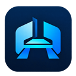
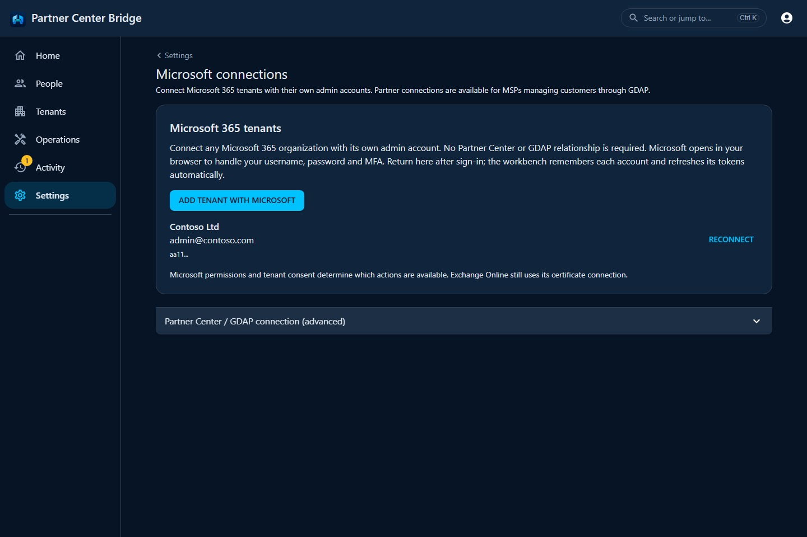

  

# Partner Center Bridge

**Your Microsoft 365 workbench. One tenant or many.**

Find a person, manage access, onboard a new hire, offboard a leaver, or deploy an Intune app across
customer tenants. Partner Center Bridge brings the work into one Windows desktop app, with plans
you can review and evidence you can put in the ticket.

Free and open source for MSP technicians and internal IT teams.

**[Download for Windows](https://github.com/Spillers-Technology/PartnerCenterBridge/releases/latest)**
&middot; [Website and product tour](https://spillerstech.us/PartnerCenterBridge/)
&middot; [Getting started](https://spillerstech.us/PartnerCenterBridge/getting-started.html)
&middot; [Release notes](https://github.com/Spillers-Technology/PartnerCenterBridge/releases)

## Open the app. Add your first tenant.

1. **Download and unzip** the signed Windows release. Each release includes a SHA-256 checksum;
   [the guide shows how to verify it](https://spillerstech.us/PartnerCenterBridge/getting-started.html#download-and-verify).
2. **Double-click `PartnerCenterBridge.exe`.** The workbench opens in its own desktop window.
   Create a local account, or choose to use it without an account on your secured computer.
3. **Choose Tenants > Add tenant with Microsoft.** Sign in through Microsoft's browser prompt
   with that organization's admin account and approve access under its policies. Return to the
   app to administer the connected tenant. Add another organization the same way.

The download is self-contained for **Windows x64** and uses **Microsoft Edge WebView2 Runtime**.
If the runtime is missing, the app shows installation guidance. No server, database, or .NET
installation is needed for the desktop download.

Want a shared instance for your team? [Run it as a server with Docker or Kubernetes](https://spillerstech.us/PartnerCenterBridge/deployment.html).

## Connect tenants your way

**Sign in with each tenant's admin account.** The Windows app includes its Microsoft sign-in
registration, so you do not need Partner Center membership, a GDAP relationship, or your own app
registration to use this flow. Each account has protected local token storage. Tokens refresh
silently when possible; when Microsoft needs you to sign in again, reconnect the remembered account.
[See the direct sign-in flow](https://spillerstech.us/PartnerCenterBridge/getting-started.html#direct-tenant-sign-in).

**Already use Partner Center?** Connect your existing partner app and Secure Application Model
credentials, then sync customers through your GDAP relationships. Partner access is optional and
can sit alongside tenants connected with their own admin accounts.
[See partner setup](https://spillerstech.us/PartnerCenterBridge/getting-started.html#partner-connection).

Access follows Microsoft consent policies and the admin's roles. Direct sign-in covers Microsoft
Graph; certificate-based Exchange Online workflows have their own
[optional setup](https://spillerstech.us/PartnerCenterBridge/getting-started.html#exchange-online).

## Get the ticket done

| The job | What the workbench brings together |
| --- | --- |
| **Find and help a person** | Search connected tenants, then see their profile, licenses, groups, authentication methods, mailbox, devices, and operation history. |
| **Onboard and offboard** | Provision from contract defaults. For offboarding, review an ordered plan, apply the selected steps, and inspect the verified results. |
| **Mirror a colleague's access** | Compare eligible cloud group memberships and add what's missing, with exclusions explained before you apply. |
| **Run a known fix** | Diagnose and address MFA, password, compromised-account, licensing, and mailbox archive issues, then check the result. |
| **Deploy apps across tenants** | Use reusable Win32 app templates and contracts to deploy or update Intune packages across selected organizations. |
| **Keep evidence** | Review changes and verification in Activity, copy ticket notes, and export operation evidence as Markdown or JSON. |

Configuration snapshots let you capture, compare, and export tenant settings. The optional
[MCP integration](https://spillerstech.us/PartnerCenterBridge/mcp-server.html) exposes operations
to automation clients with tenant permissions and a human approval queue.

When a permission or dependency is missing, the affected section explains why it is unavailable.
Planned operations show what will change before you apply them, and their outcomes reflect what
verification could confirm.

## Where the project stands

**Current release: v0.9.2.** The desktop workbench, direct tenant sign-in, known fixes, and planned
operations are beta. Tests cover Microsoft API behavior with mocks; live-tenant validation is
still ongoing. Microsoft publisher verification is not yet complete, so organizations that
restrict unverified apps may require their own admin-consent process.

Mirror access currently copies eligible direct cloud group memberships, not every kind of
Microsoft 365 permission. Configuration snapshots compare and export settings; they do not apply
changes. See the [product limitations](https://spillerstech.us/PartnerCenterBridge/#security),
[operation details](https://spillerstech.us/PartnerCenterBridge/operations.html), and [roadmap](ROADMAP.md)
before choosing a workflow for a customer.

## Documentation

| Start here | Go deeper |
| --- | --- |
| [Getting started](https://spillerstech.us/PartnerCenterBridge/getting-started.html) | Download, first launch, tenant connections, and optional Exchange setup |
| [Desktop workbench](https://spillerstech.us/PartnerCenterBridge/local-workbench.html) | Local data, diagnostics, browser/tray mode, CLI, and building the Windows app |
| [Operations](https://spillerstech.us/PartnerCenterBridge/operations.html) | Person workspace, mirror access, offboarding, and evidence |
| [Known fixes](https://spillerstech.us/PartnerCenterBridge/workflows.html) | Diagnosis, remediation, and verification |
| [Configuration snapshots](https://spillerstech.us/PartnerCenterBridge/config-snapshots.html) | Capture, diff, export, and optional git sync |
| [Server deployment](https://spillerstech.us/PartnerCenterBridge/deployment.html) | Docker, Kubernetes, configuration, and upgrades |
| [Accounts and access](https://spillerstech.us/PartnerCenterBridge/authentication.html) | Local accounts, tenant sharing, roles, and OIDC |
| [Architecture](https://spillerstech.us/PartnerCenterBridge/architecture.html) | Projects, auth flows, persistence, and extension points |

## Build with us

Partner Center Bridge uses .NET 8, React, and TypeScript, with a WPF/WebView2 desktop host.
See [Contributing](CONTRIBUTING.md) for development and tests, or
[open an issue](https://github.com/Spillers-Technology/PartnerCenterBridge/issues) with a bug or
workflow request. Report vulnerabilities through [Security](SECURITY.md).

[MIT licensed](LICENSE). An independent project from Spillers Technology; not affiliated with or
endorsed by Microsoft.
